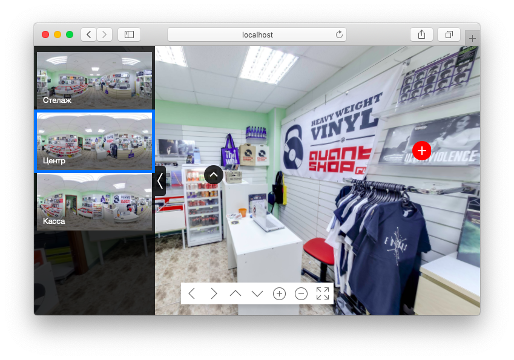

Tour-player
===========
A simple 360° tour viewer for web & VR Web Player - HTML5

[](https://travis-ci.org/Tour-360/tour-player)


[](http://tour-player.herokuapp.com?fov=84.5&lat=-1.65&lon=-30.9&id=1)

Example: **[tour-player.herokuapp.com](http://tour-player.herokuapp.com?fov=84.5&lat=-1.65&lon=-30.9&id=1)**

### Getting started
Add between tags `head`
```
<link rel="stylesheet" href="/tour-player/latest/tour-player.css">
<script src="https://tour-360.ru/tour-player/latest/tour-player.js"></script>
```

Add JavaScript
```
Tour.init({
  title: "Tour name",
  panorams: [
    {
      id: "0", // folder name
      title: "First pano",
    }
  ]
}, {
    controlPanel: false,
    gallery: true
});

Tour.on('load', function(data) {
    this.controls.autoRotate();
})
```

See [example code](https://github.com/Tour-360/tour-player/tree/master/example)


## Development

Clone this repository

`git clone https://github.com/Tour-360/tour-player.git && cd tour-player`

`npm install -g gulp bower`

`npm install`

#### Run server (browserSync)
```gulp serve ```

#### Build
```gulp build```
